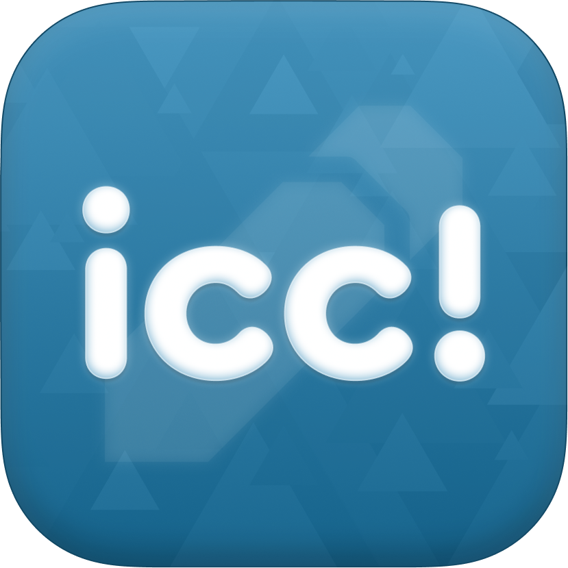

# icc!future

原名：`InkCanvasForClass` 
可能是最好用的教学批注软件，欲火重生 

**基于 `InkCanvas` 控件的又一次倔强**

> [!IMPORTANT]
> 虽然 InkCanvasForClass 本体不再维护，但 InkCanvasForClass.PowerPoint.InteropHelper、InkCanvasForClass.PowerPoint.VstoPlugin、InkCanvasForClass.IACoreHelper等附属项目还会继续开发。InkCanvasForClass.IccInkCanvas 会继续维护并添加新代码。（高实验性）

- **开源许可**： GNU General Public License Version 3
- **开发者**： dubi906w
- **耻辱柱**： **`幻想熵K2ro`**